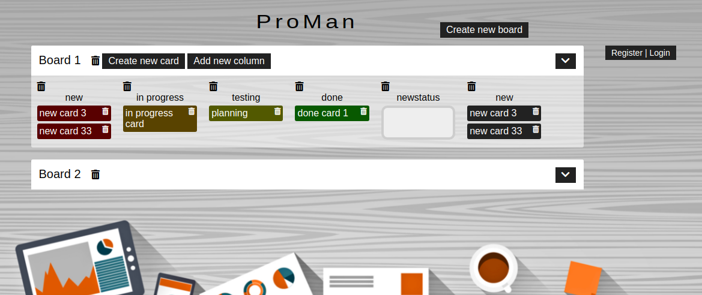

# ProMan

## About the project

This is a learning aimed project implemented during the WEB module of the Codecool training course to complete tasks in a team in two sprints.

Our learning aim was to: 
        - create an advanced Flask project 
        - practical usage of AJAX 
        - mastering web development 
        - planning the development of an advanced product 

## Applied technologies

Front end: HTML, CSS, Javascript 
Back end: Python, Flask server, postgres-based database  

  

## Technical information for building up database of the project 

The runnable version can be found on the development branch of the repository.

1. After cloning the project to the local machine, the next step is the creation of an SQL database within 
the local repository:
sudo -u <user_name> createdb <name_of_database> 

2. Initiating connection to the created database:  
\connect <name_of_database>
    
3. Set up *Environment Variables* for running from localhost:
    PSQL_USER_NAME=<your_username>>;
    PSQL_PASSWORD=<your_chosen_password>;
    PSQL_HOST=localhost;
    PSQL_DB_NAME=<name_of_database>    
    
4. Move to "data/" folder and enter command into the terminal:  
    psql -q <name_of_database> < <sql_file_name>
    
        users.sql
        create_tables.sql
        column_validation.sql
        board_column.sql
    

## User information about main functionalities of the codecool series webpage

   
        1. There is a "Create new board" button after opening the root url (/) 
        2. After clicking the "Create new board" button, the user can give the new board's title in an editable field 
        3. There's a "Save" button that saves the new board along with its title (it displays on the board's page and the 
         board list)
        4. When the user clicks on the board's title, it changes into an input box where the user can input the new title 
        5. There's a "Save" button that saves the board's new title (displayed on the board's page and the board list page) 
        6. The board's title is visible on the top of the page 
        7. The board closes after clicking on its title 
        8. There is a "Add new column" button after opening a board 
        9. A new column is added to the board after pressing the "Add new column" button with the title given by the user. 
        The column can be used as a status for the cards 
        10. The board's title is visible on the top of the page 
        11. The Board closes after clicking on its title 
        12. When the user clicks on a columns's title, it changes into an input box where the user can input a new title 
        13. The column's new title gets saved by pressing Enter 
        14. The column's original title shows up unchanged after the user clicked out of the input box or pressed Escape 
        15. There is a "Create new card" button after opening a board 
        16. A new card is added to the first column of the board after pressing the "Create new card" with the title given 
        by the user 
        17. Allow the user to drag the cards above or below each other and ensure that the card stays in the new position 
        (its order is updated) 
        18. Allow the user to drag the cards from one column to another and ensure that the card stays in the new position 
        (its status is updated) 
        19. When the user clicks on the card's title, it changes into an input box where the user can input a new title 
        20. The card's new title gets saved by pressing Enter 
        21. The card's original title shows up unchanged after the user clicked out of the input box or pressed Escape 
        22. There's a register link on the page after opening the root url (/) that leads to the registration page 
        23. There is a registration form where the user can input a chosen username and password 
        24. There is a submit button in the registration form. By clicking it, the user's credentials get stored and the 
        user can log in with them later 
        25. There is a "Login" button in the main page's header if the user is not logged in 
        26. After clicking the "Login" button there is a login page where the user can input his/her username and password 
        27. After logging in, the user can see the list of the public and private boards 
        28. Allow the logged-in user to crate private boards that are only visible to him/her 
        29. There is a "Create new private board" button when the user is logged in 
        30. After clicking the "Create" button, allow the user to input the new private board's title in an editable field 
        31. There's a "Save" button that saves the new private board along with its title 
        32. Ensure that the private board is visible only when the user who created it is logged in 
        33. There is a logout link when the user is logged in 
        34. After clicking the logout link the user gets logged out and is able to see the public boards only 
        35. There is a delete icon associated with every public board 
        36. After clicking a delete icon, the associated board gets deleted along with its cards 
        37. There is a delete icon associated with every private board that belongs to the logged-in user 
        38. After clicking a delete icon, the associated Board gets deleted along with its cards 
        39. There is a delete icon associated with every card 
        40. After clicking a delete icon, the associated card gets deleted from the board 
        41. There is a delete icon associated with every column 
        42. After clicking a delete icon, the associated column gets deleted from the board along with its cards 
